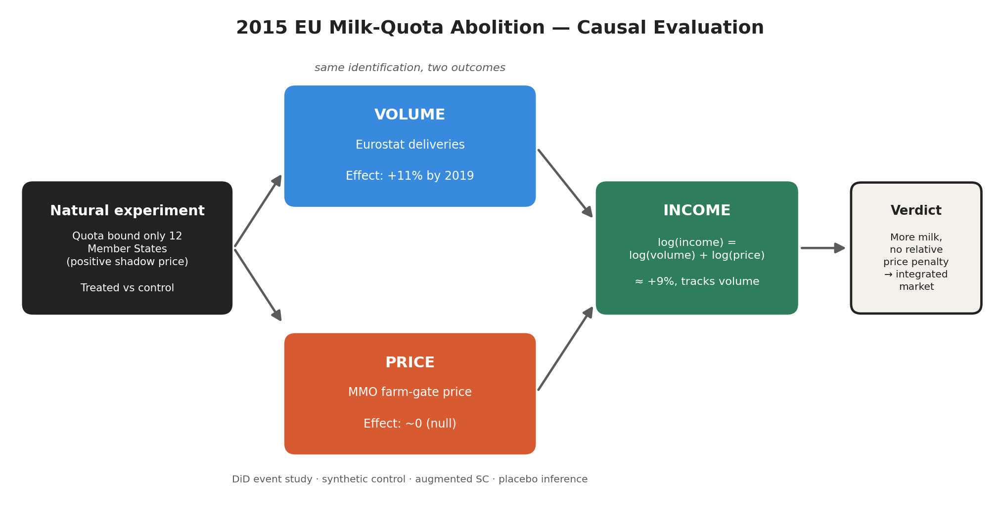
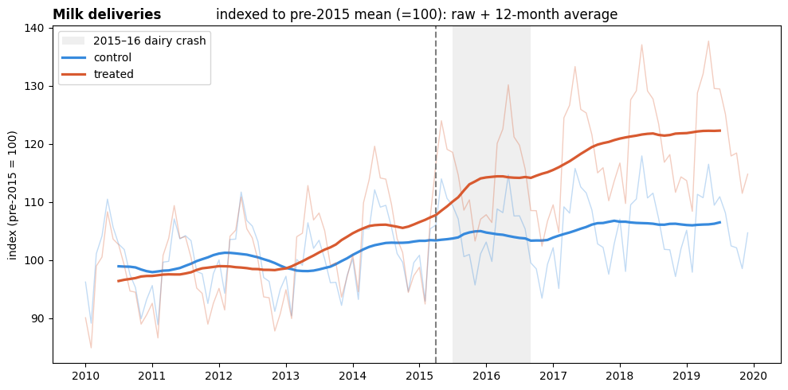
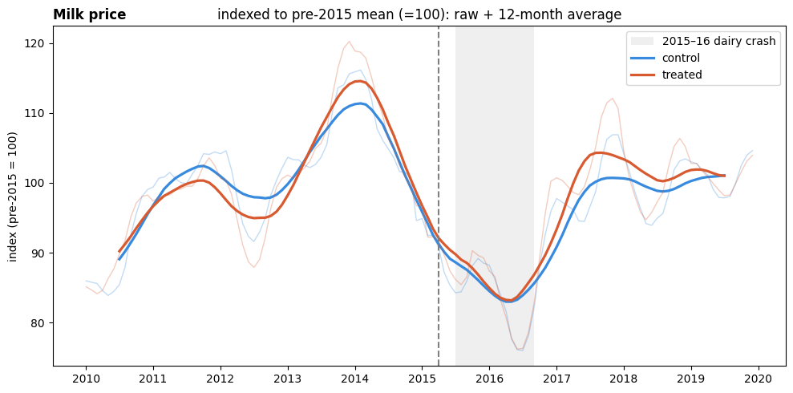
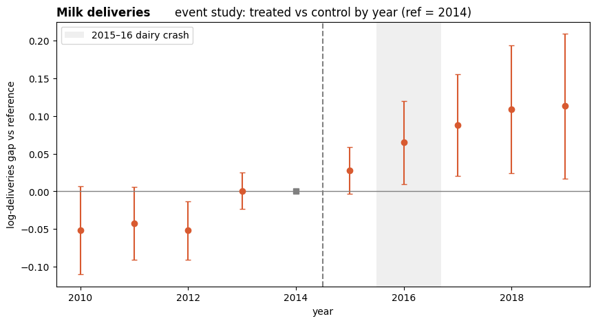
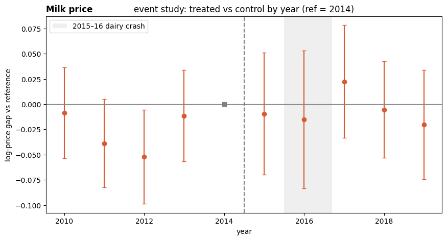
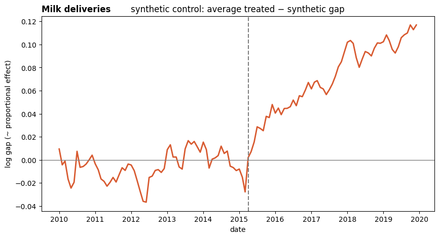
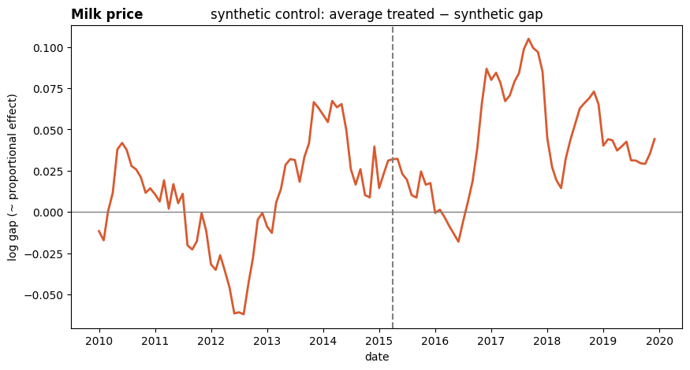
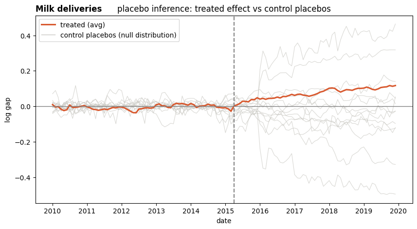
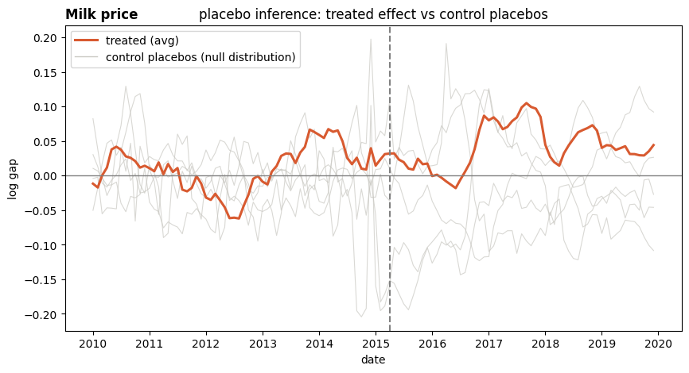
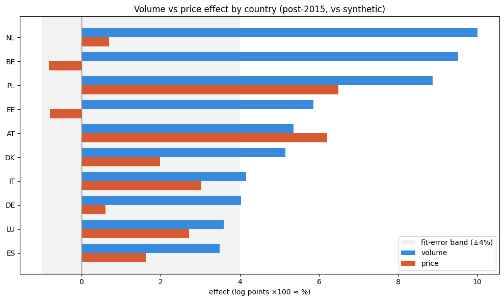

# More Milk, Same Price: A Causal Evaluation of the EU Milk-Quota Abolition

**A causal evaluation of the 2015 EU milk-quota abolition, estimating its effect on production, farm-gate price, and ultimately farm income, using difference-in-differences and synthetic control, triangulated across four methods.**


---

## The question

For 31 years the EU capped how much milk each country could produce. In April 2015 the cap was lifted. The official promise was that farmers would finally be free to grow, but more milk on the market can push the price *down*, so whether farmers actually ended up better off is not obvious. And it is a genuinely **causal** question: not "what happened to milk after 2015?" but "what happened **because of** the abolition, as opposed to everything else going on in those years?"

This project answers it the way a policy economist would: by building an explicit counterfactual, what *would* have happened without the reform, and measuring the deviation from it. The key that makes identification possible is that the quota only truly bound **some** countries. The 12 Member States whose quota shadow price was positive were genuinely constrained; the rest were not. That split is the natural experiment.



---

## Headline result

The abolition produced a **clear, robust volume effect and no price penalty relative to controls, so farm income rose, driven by volume.**

| Outcome | Effect vs counterfactual | How sure we are |
|---|---|---|
| **Volume** | **+11%** by 2019 | Robust across DiD + synthetic control |
| **Price** | **~0** (null differential) | Confirmed by **four** independent methods |
| **Income** | **≈ +9%**, tracking volume | Exact decomposition: income = volume × price |

The price null is not a weakness, it *is* the finding. Raw-milk prices form at the **EU level**, so a supply increase in the treated countries diffuses across the whole market and leaves no treated-vs-control gap. A clear volume effect beside a null price differential is the **signature of an integrated market**, and recognising which questions a treated-vs-control design *can* answer is part of the contribution.

---

## Two outcomes, one design, run in parallel

The volume and price analyses use the **identical identification strategy** on different outcomes, same treated group, same methods, same diagnostics, which is exactly what makes their comparison clean. Throughout this README they are shown side by side.

### 1. Parallel trends: the assumption, checked

Before estimating anything, the pre-2015 period must show the treated and control groups moving together. They do, for both outcomes (each country indexed to its own pre-2015 mean = 100).

Volume | Price
:---:|:---:
 | 

### 2. Event study: the effect over time

One treated-vs-control coefficient per year, relative to 2014. Volume opens a clear, growing gap after the break; price stays flat, every post-2015 coefficient is insignificant.

Volume | Price
:---:|:---:
 | 

### 3. Synthetic control: a second, assumption-free estimate

Instead of assuming parallel trends, this rebuilds each treated country's *own* pre-2015 path from a weighted mix of controls. The treated-minus-synthetic gap opens for volume and stays flat for price, agreeing with the event study under entirely different assumptions.

Volume | Price
:---:|:---:
 | 

### 4. Placebo inference: is the effect real?

Each control is treated as if it had been treated, building the distribution of effects we would see *when nothing happened*. The volume effect stands outside that cloud; the price effect sits buried inside it.

Volume | Price
:---:|:---:
 | 

---

## The payoff: farm income

Income is the product of the two outcomes; `log(income) = log(volume) + log(price)`; and the identity holds **country by country**, so the two analyses recombine exactly, regardless of their different control sets. With a real volume gain and a price-neutral result, income tracks volume: the constrained countries produced more, and the integrated market spared them a relative price cut.



The grey band marks the synthetic-control noise level (~4%): volume bars clear it (a real effect), price bars sit inside it (noise). The two countries where price looks large (Austria, Poland) fail placebo inference, share no economic story, and carry the wrong sign, reported for transparency, read as noise.

---

## What makes this more than a regression

- **Two outcomes, one identification strategy**, run in parallel so their comparison is clean by construction.
- **Triangulation across four methods**, DiD event study, standard *and* augmented synthetic control, and permutation inference, so the conclusion never rests on a single set of assumptions.
- **A null taken seriously.** The price result is a null, and the project treats it as a finding to be stress-tested and explained (market integration), not a failure to be buried.
- **Identification honesty.** Every estimate is explicitly *relative to the control group*; the limits of what the design can and cannot identify (e.g. an EU-wide aggregate price change) are stated, not glossed over.
- **Treatment by economic mechanism**, not by data convenience: the treated group is defined by a *binding quota shadow price* — the actual channel through which the policy could bite — not by a country list chosen after the fact.
- **Fail-loud engineering.** Country-code mapping, treatment assignment, and panel completeness are all asserted, so a silent data error halts the run rather than quietly corrupting an estimate.

---

## Method in one paragraph

The estimand is the effect of the abolition on the binding ("treated") Member States relative to the non-binding ("control") ones. The **event study** is a fixed-effects difference-in-differences (`log(outcome) ~ year × treated | country + month`, clustered by country): country fixed effects absorb level differences, month fixed effects absorb EU-wide shocks (the 2014 Russian ban, the 2015–16 dairy crash), and the per-year coefficients trace the dynamic effect against a 2014 baseline. The **synthetic control** drops the parallel-trends assumption: for each treated country it builds a counterfactual from a convex mix of controls that reproduces its own pre-2015 path, with an **augmented (ridge) variant** that permits regularised extrapolation for edge cases, every fit judged by the same objective pre-period RMSPE. **Placebo inference** supplies significance by permutation. The two outcomes are then combined on the income identity, country by country.

---

## Project structure

```
repo/
    production_notebooks/
        01_volume.ipynb                    # quantity: DiD + synthetic control + inference
        02_price.ipynb                     # price: the same design, run independently
        03_income.ipynb                    # income = volume × price decomposition
    src/
        ingest.py                          # Eurostat deliveries  -> panel
        ingest_price.py                    # MMO farm-gate price   -> panel
        treatment.py                       # binding-quota assignment, period flags
        estimation.py                      # event-study DiD (pyfixest)
        synth.py                           # synthetic control (standard + augmented)
    assets/                                # charts
    requirements.txt
```

The original notebook holds the full exploratory analysis with all intermediate outputs. The production notebooks are a clean, modular reorganisation: each step is preceded by the reasoning that motivates it and followed by the conclusions drawn from its output.

---

## How to run it

```
git clone https://github.com/JuanGarridoGarcia/More-Milk-Same-Price-Causal-Evaluation-EU-Milk-Quota-Abolition-
cd More-Milk-Same-Price-Causal-Evaluation-EU-Milk-Quota-Abolition-
pip install -r requirements.txt
```

Place the source files in `data/raw/`, Eurostat cows' milk collection (`apro_mk_colm`) for deliveries, and the EU Milk Market Observatory raw-milk price Excel for price, then run the production notebooks in order: `01_volume`, `02_price`, `03_income`.

Data sources: [Eurostat](https://ec.europa.eu/eurostat) (`apro_mk_colm`) and the [EU Milk Market Observatory](https://agridata.ec.europa.eu/extensions/DashboardMilk/MilkProduction.html) (raw milk prices).

---

## Limitations

This is a portfolio research project, and its conclusions are bounded accordingly. Every effect is measured **relative to the control group**, not in absolute terms: because treated and control share the same EU-level price market, an EU-wide price change is invisible to this design, so the absolute income gain could be smaller than the relative one. The price control pool is thin (the UK is absent from the price data; Croatia, Malta and partial-coverage donors are dropped on their own evidence), which widens per-country noise and coarsens placebo resolution. The post-period spans the 2015–16 dairy crash and the 2014 Russian import ban, large EU-wide price shocks, absorbed only insofar as they hit both groups alike. Cyprus and Ireland fall out of the income step on fit and coverage grounds, and Luxembourg's price series ends in 2018. All of these are documented in-line in the notebooks.

---

## Tech stack

Python 3.13 · pyfixest (fixed-effects DiD) · NumPy / SciPy (synthetic control, custom ridge-augmented solver) · pandas · matplotlib · Eurostat & EU Milk Market Observatory data.
